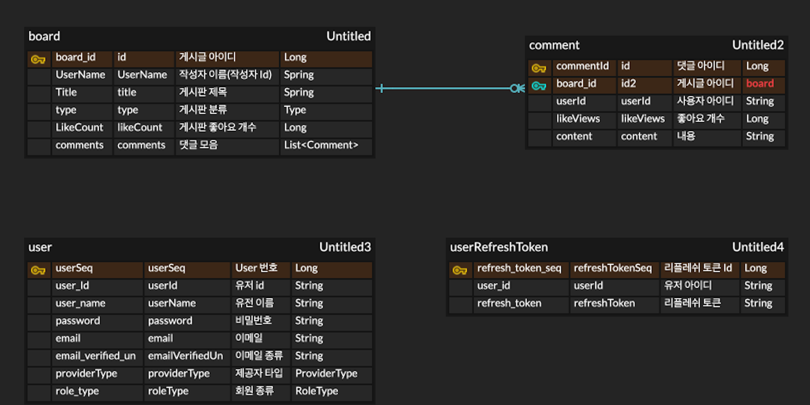

# RSE-Back-End
🗣️ 커뮤니티 서비스 입니다.
---

### 1. 프로젝트 주제
>  **[프로젝트 게임](https://play.google.com/store/apps/details?id=com.DefaultCompany.Team_Project) 커뮤니티 사이트 입니다.**   
> 커뮤니티를 중점으로 여러 종목의 게시판과 게임관련 자료를 확인 할 수 있는 서비스 입니다.
      

### 2. Back_End Server API 문서
> 🔗 [BackServer](http://15.165.122.126:8080/swagger-ui/index.html#/)
 

### 3. Stack
- Java 11
- Spring boot 2.7.4
- Spring Data JPA 2.7.3
- Spring Security 5.7.3
- Gradle
- H2(local)
- AWS (Ec2, S3, RDS)
   

### 4. ERD 설계

 
